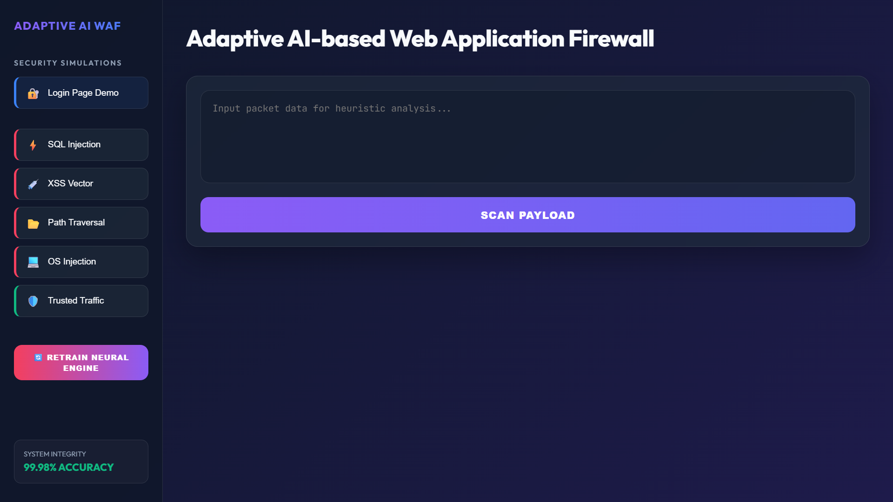
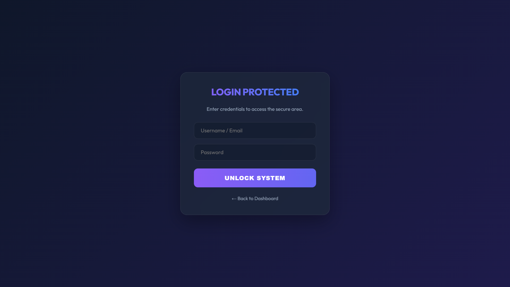
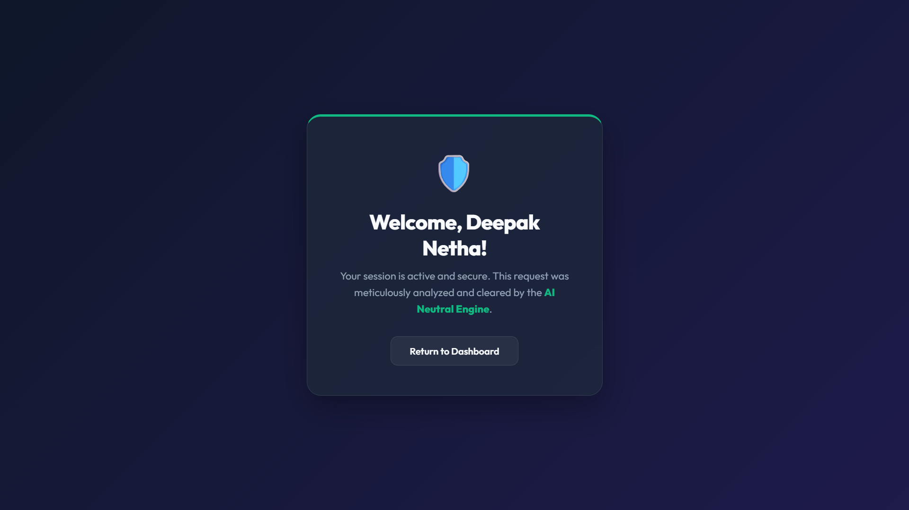
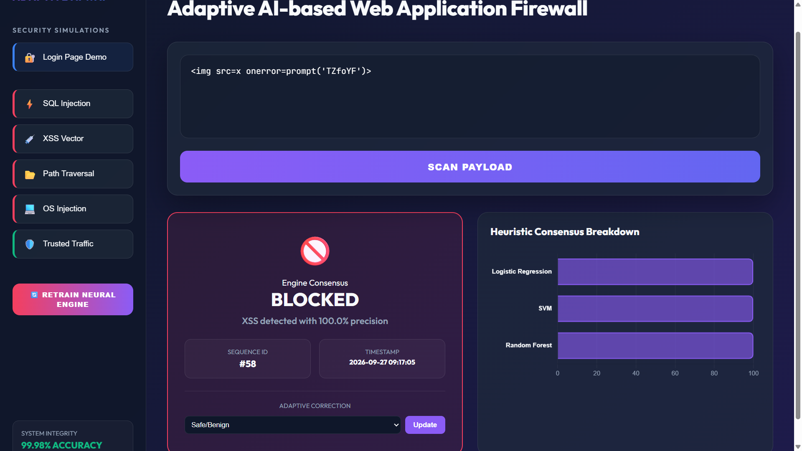
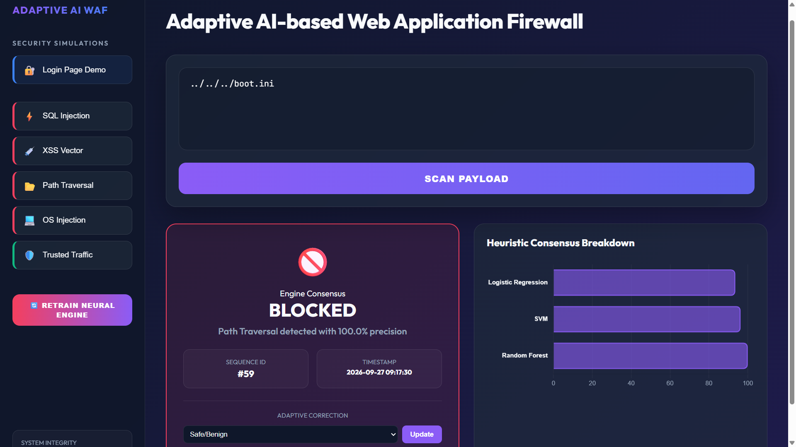
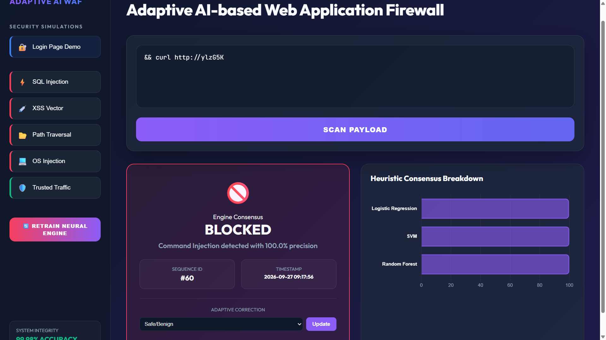
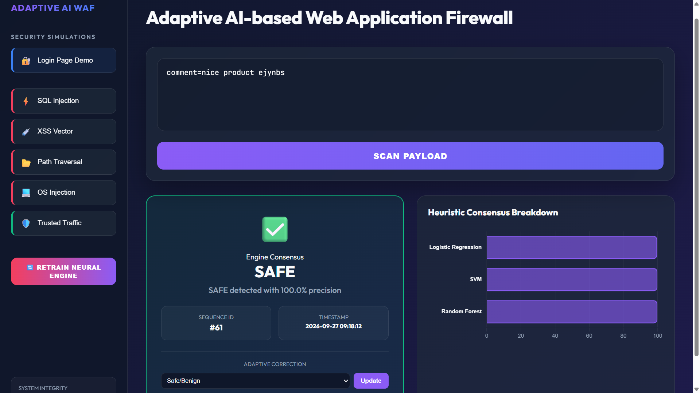

# 🛡️ AIWAF — Adaptive AI-Based Web Application Firewall

AIWAF is a Web Application Firewall that uses Machine Learning instead of fixed rules to detect malicious web traffic in real time — classifying requests as safe or as SQL Injection, XSS, Path Traversal, or Command Injection using an ensemble of ML models.

## 🌐 Live Demo
https://aiwaf.onrender.com

## ✨ Features
- Real-time payload scanning
- Multi-model AI consensus (Logistic Regression, SVM, Random Forest)
- SQL Injection Detection
- XSS (Cross-Site Scripting) Detection
- Path Traversal Detection
- Command Injection Detection
- Simulated Login Page demo
- Adaptive retraining ("Retrain Neural Engine")
- Live confidence scoring per model

## 🖥 Dashboard

## 🔐 Login Protection Demo
A simulated login form that runs every submitted username and password through the same AI detection engine before granting access.

  
  

## 📊 Scan Results

  
  

  
  
  

## 🐳 DevOps Pipeline
- **Containerized** with Docker for consistent, portable deployment
- **CI/CD** via GitHub Actions — every push is automatically built and smoke-tested
- **Image Registry** — tested images published to GitHub Container Registry (GHCR)
- **Infrastructure as Code** — Terraform configuration included for AWS EC2 deployment
- **Continuous Deployment** to Render — auto-redeploys on every push to `main`

## 🛠 Tech Stack
- Python
- Flask
- scikit-learn
- pandas / numpy
- Docker
- GitHub Actions
- Terraform
- Render

## 👨‍💻 Author
Samala Deepak Kumar

© 2026 AIWAF
